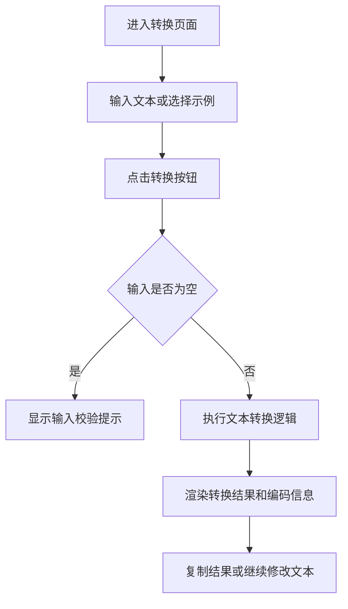

## 1. 产品概述
为现有 `mota-lang` 项目补充一个 React + TypeScript 单页前端，让用户输入普通文本后点击按钮即可查看“魔塔语”转换结果。
- 目标用户是希望快速试验字符转换效果的开发者、玩家或内容维护者，降低必须运行命令行脚本的使用门槛。
- 产品价值是把当前仅脚本可用的能力变成可视化工具，同时保留后续继续扩展批量转换、编码详情展示与结果复制能力的空间。

## 2. 核心功能

### 2.1 功能模块
1. **转换主页**：标题说明、输入区、转换按钮、示例快捷填充。
2. **结果展示区**：展示原文、自动转繁体文本、魔塔语错读结果、可见部分、字节信息。
3. **交互辅助区**：复制结果、错误提示、空输入校验、状态反馈。

### 2.2 页面详情
| 页面名称 | 模块名称 | 功能描述 |
|-----------|-------------|---------------------|
| 转换主页 | 顶部介绍区 | 说明该工具将文本按 Big5 写入并按 GBK 错读，帮助用户理解“魔塔语”生成过程 |
| 转换主页 | 文本输入框 | 支持用户输入任意文本，保留换行，限制为空时不可提交 |
| 转换主页 | 示例按钮组 | 提供“绿蝙蝠”“锁匙”“绿色史莱姆”“魔塔”等快速示例，点击后自动填入 |
| 转换主页 | 转换操作区 | 点击“转换成魔塔语”后执行转换逻辑，处理中给出明确反馈 |
| 转换主页 | 结果卡片区 | 分块展示原始输入、繁体写入文本、错读完整结果、错读可见部分和码点信息 |
| 转换主页 | 复制与提示 | 支持复制主要结果文本，并在复制成功或失败时显示提示 |

## 3. 核心流程
用户打开页面后，在输入框输入中文文本或点击预置示例，随后点击转换按钮。前端调用项目中的转换逻辑，立即生成分析结果并渲染在结果区。若输入为空则提示先输入内容；若转换成功，用户可继续复制“魔塔语”结果或更换文本再次转换。

## 4. 用户界面设计
### 4.1 设计风格
- 主色采用深墨绿与铜金色，呼应“魔塔”“古籍编码”的复古感。
- 按钮使用圆角矩形与微弱发光边框，强调操作反馈但不过度花哨。
- 标题字体偏展示感，正文保持清晰易读；结果区使用等宽字体展示字节与 Unicode 信息。
- 布局采用桌面优先的双栏卡片式设计：左侧输入与操作，右侧结果与说明。
- 图标建议使用简洁线性图标，配合少量像素风细节强化“游戏文本工具”气质。

### 4.2 页面设计概览
| 页面名称 | 模块名称 | UI 元素 |
|-----------|-------------|-------------|
| 转换主页 | 顶部介绍区 | 深色渐变背景、醒目标题、副标题、轻微纹理和边框装饰 |
| 转换主页 | 输入区 | 大尺寸文本域、字符统计、示例按钮、明确的主操作按钮 |
| 转换主页 | 结果区 | 多张信息卡片、重点结果高亮、字节内容使用等宽字展示、支持复制按钮 |
| 转换主页 | 状态提示 | 空态说明、错误提示、复制成功提示、轻量动画过渡 |

### 4.3 响应式
采用桌面优先设计，在桌面端展示双栏布局，在平板与手机端折叠为纵向单栏；按钮和文本域在触屏设备上保持足够点击区域。
