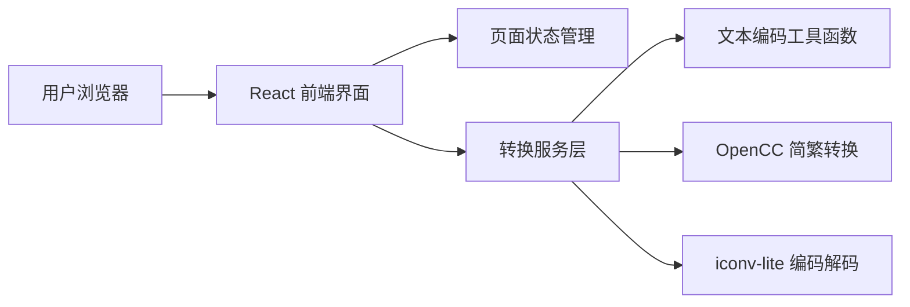

## 1. 架构设计


## 2. 技术描述
- 前端：React 18 + TypeScript + Vite
- 样式：Tailwind CSS 3
- 状态管理：Zustand
- 图标：lucide-react
- 核心能力复用：保留现有 `iconv-lite` 与 `opencc-js`，将 `main.js` 中的转换逻辑抽离为前端可复用的 TypeScript 模块
- 初始化方式：`vite-init` 的 `react-ts` 模板

## 3. 路由定义
| 路由 | 用途 |
|-------|---------|
| / | 魔塔语转换主页，负责输入、转换与结果展示 |

## 4. API 定义
当前方案不引入后端 API。所有转换逻辑在前端本地执行，以减少复杂度并保留离线可用性。

### 4.1 核心 TypeScript 类型
```ts
type ConversionViewModel = {
  originalLabel: string
  sourceText: string
  byteLength: number
  bytesHex: string
  target: {
    text: string
    visibleText: string
    visiblePortion: string
    unicodeEscapes: string
  }
  visiblePortionRoundTrip: {
    text: string
    byteLength: number
    bytesHex: string
    source: {
      text: string
      visibleText: string
      visiblePortion: string
      unicodeEscapes: string
    }
  } | null
}
```

## 5. 数据模型
本项目当前无需数据库。运行时数据仅保存在浏览器内存中，包括：
- 当前输入文本
- 最近一次转换结果
- 复制提示与界面状态

## 6. 模块划分
| 模块路径 | 职责 |
|-----------|------|
| `src/pages/HomePage.tsx` | 组织整页布局与交互流程 |
| `src/components/InputPanel.tsx` | 输入框、示例按钮和转换操作 |
| `src/components/ResultPanel.tsx` | 展示转换结果、字节信息与复制操作 |
| `src/components/ResultCard.tsx` | 复用型结果信息卡片 |
| `src/store/useConverterStore.ts` | 管理输入、转换结果和 UI 状态 |
| `src/utils/motaConverter.ts` | TypeScript 版本的核心转换逻辑 |

## 7. 实施说明
- 使用 `react-ts` 模板初始化工程，将当前 Node 脚本项目升级为带前端的 Vite 项目。
- 保留原有命令行能力：将现有 `main.js` 调整为可继续作为 CLI 入口，或改为从共享逻辑模块中导入。
- 前端首屏直接聚焦在输入与转换，不增加多页面复杂度。
- 结果展示优先突出“错读可见部分”，同时保留完整字节与码点信息供开发者调试。
- 补充基础单元测试，覆盖典型词条与空输入分支。
